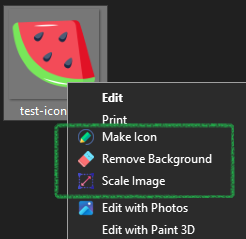

[//]: # (Constants)
[privacy-link]: ./PRIVACY.md
[coffee-link]: https://buymeacoffee.com/spark88
[issues-link]: ../../issues
[fork-link]: ../../fork

<div align="center">


# PicLet

**Image manipulation utility toolkit with Windows shell integration**

[](https://www.npmjs.com/package/@spark-apps/piclet)
[][coffee-link]
[][issues-link]

</div>

---

## Features

| Tool | Description | Formats |
|------|-------------|---------|
| **Make Icon** | Convert images to ICO with multiple resolutions (256, 128, 64, 48, 32, 16) | PNG |
| **Remove Background** | Remove solid backgrounds with configurable fuzz tolerance | PNG |
| **Scale Image** | Resize images with optional square padding | PNG, JPG, GIF, BMP |
| **Icon Pack** | Generate complete icon sets for Web, Android, and iOS | PNG, JPG |

## Installation

### Via npm (Recommended)

```bash
npm install -g @spark-apps/piclet
```

This automatically registers the Windows context menu entries.

### Requirements

- **WSL** (Windows Subsystem for Linux)
- **ImageMagick** in WSL:
  ```bash
  sudo apt update && sudo apt install imagemagick
  ```
- **Node.js** >= 18

## Usage

### Context Menu

Right-click any supported image file in Windows Explorer to see PicLet options:

<div align="center">

</div>

### Command Line

```bash
# Convert PNG to ICO
piclet makeicon logo.png

# Remove background
piclet remove-bg photo.png

# Scale image
piclet scale image.jpg

# Generate icon pack for all platforms
piclet iconpack app-icon.png
```

### Manual Registry Management

```bash
# Re-register context menu entries
piclet install

# Remove context menu entries
piclet uninstall
```

## Uninstallation

```bash
npm uninstall -g @spark-apps/piclet
```

This automatically removes the Windows context menu entries.

## Icon Pack Output

When you run `piclet iconpack`, it generates:

**Web** (8 files)
- `favicon.ico`, `favicon-16x16.png`, `favicon-32x32.png`, `favicon-48x48.png`
- `apple-touch-icon.png` (180px)
- `android-chrome-192x192.png`, `android-chrome-512x512.png`
- `mstile-150x150.png`

**Android** (6 files)
- `mipmap-mdpi` through `mipmap-xxxhdpi` directories
- `playstore-icon.png` (512px)

**iOS** (15 files)
- All `AppIcon` sizes including @2x/@3x variants
- `AppIcon-1024.png` for App Store

## Support & Contributions

Star the repo and I power up like Mario!

Devs run on [coffee][coffee-link].

[Contributions][fork-link] are welcome.

---

<div align="center">
<sub>Released under MIT License | <a href="./PRIVACY.md">Privacy Policy</a></sub>
</div>
