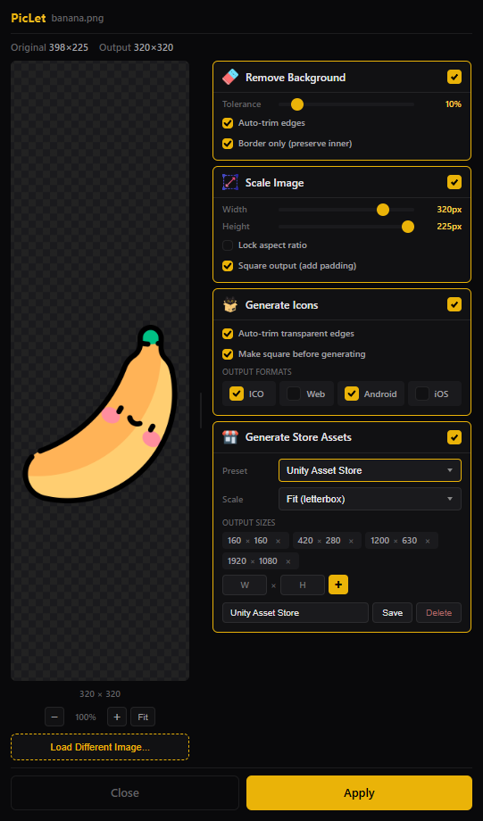
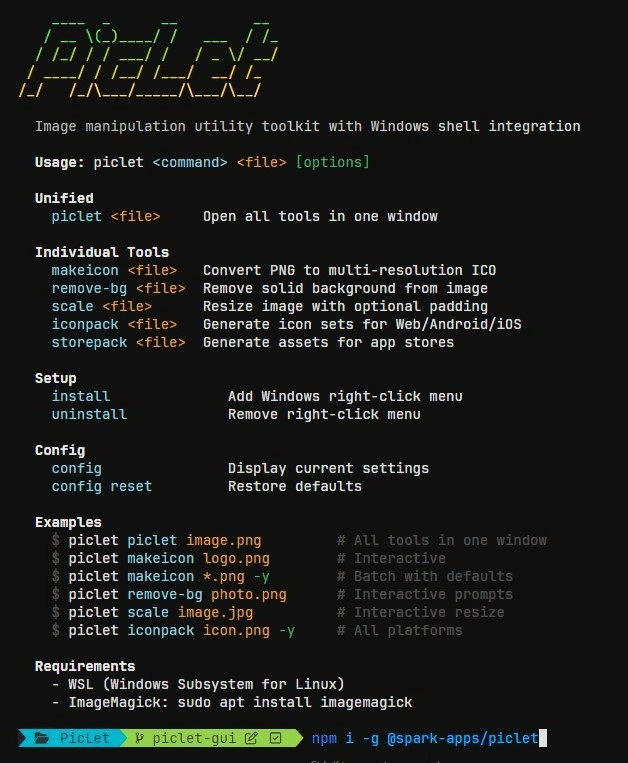

[//]: # (Constants)
[privacy-link]: ./PRIVACY.md
[coffee-link]: https://buymeacoffee.com/spark88
[issues-link]: ../../issues
[fork-link]: ../../fork

<div align="center">


# PicLet

**Lightweight image tools for content creators • CLI, GUI, and Web**

[](https://www.npmjs.com/package/@spark-apps/piclet)
[](https://github.com/sponsors/muammar-yacoob)
[][coffee-link]
[][issues-link]

</div>

---

## 🌐 Try PicLet Online

**[piclet.app](https://piclet.app)** - Use all tools directly in your browser. No installation, 100% client-side processing, your images never leave your device.

---

## Tools & Features

<table>
<thead>
<tr>
<th width="80" align="center">Tool</th>
<th>Description</th>
<th>Formats</th>
<th>Available In</th>
</tr>
</thead>
<tbody>
<tr>
<td align="center"></td>
<td><strong>Make Icon</strong><br>Convert images to ICO with multiple resolutions (256, 128, 64, 48, 32, 16)</td>
<td>PNG</td>
<td>CLI, GUI, Web</td>
</tr>
<tr>
<td align="center"></td>
<td><strong>Remove Background</strong><br>Remove solid backgrounds with configurable fuzz tolerance</td>
<td>PNG</td>
<td>CLI, GUI, Web</td>
</tr>
<tr>
<td align="center"></td>
<td><strong>Scale Image</strong><br>Resize images with optional square padding</td>
<td>PNG, JPG, GIF, BMP</td>
<td>CLI, GUI, Web</td>
</tr>
<tr>
<td align="center"></td>
<td><strong>Icon Pack</strong><br>Generate complete icon sets for Web, Android, and iOS</td>
<td>PNG, JPG</td>
<td>CLI, GUI, Web</td>
</tr>
<tr>
<td align="center"></td>
<td><strong>Store Assets</strong><br>Generate graphics for Steam, itch.io, Unity Asset Store, and app stores</td>
<td>PNG, JPG</td>
<td>GUI, Web</td>
</tr>
</tbody>
</table>

---

## Get Started

### 🌐 Web Version (No Installation)

Visit **[piclet.app](https://piclet.app)** - Works in any modern browser, 100% client-side processing.

### 💻 Desktop Version (Windows)

Download and install via npm for CLI access and Windows Explorer integration:

```bash
npm install -g @spark-apps/piclet
```

**Requirements:**
- Windows with WSL (Windows Subsystem for Linux)
- ImageMagick in WSL: `sudo apt update && sudo apt install imagemagick`
- Node.js >= 18

---

## Desktop Usage

### 🖱️ GUI Mode (Right-Click Integration)

Right-click any image file in Windows Explorer to access PicLet tools:

<div align="center">

</div>

<div align="center">

<p><em>GUI with real-time preview and batch processing</em></p>
</div>

### ⌨️ CLI Mode (Command Line)

Fast batch processing via terminal:

```bash
# Convert PNG to ICO
piclet makeicon logo.png

# Remove background
piclet remove-bg photo.png

# Scale image
piclet scale image.jpg

# Generate icon pack for all platforms
piclet iconpack app-icon.png

# Open GUI with store assets preset
piclet storepack image.png
```

<div align="center">

<p><em>CLI for automation and batch operations</em></p>
</div>

### Registry Management

```bash
# Re-register context menu entries
piclet install

# Remove context menu entries
piclet uninstall

# Uninstall completely
npm uninstall -g @spark-apps/piclet
```

## Icon Pack Output

When you run `piclet iconpack`, it generates:

**Web** (8 files)
- `favicon.ico`, `favicon-16x16.png`, `favicon-32x32.png`, `favicon-48x48.png`
- `apple-touch-icon.png` (180px)
- `android-chrome-192x192.png`, `android-chrome-512x512.png`
- `mstile-150x150.png`

**Android** (6 files)
- `mipmap-mdpi` through `mipmap-xxxhdpi` directories
- `playstore-icon.png` (512px)

**iOS** (15 files)
- All `AppIcon` sizes including @2x/@3x variants
- `AppIcon-1024.png` for App Store

## Support & Contributions

⭐ Star the repo and I power up like Mario!<br>
☕ Devs run on [coffee][coffee-link].<br>
🤝 [Contributions][fork-link] are welcome.

---

<div align="center">
<sub>Released under MIT License | <a href="./PRIVACY.md">Privacy Policy</a></sub>
</div>
